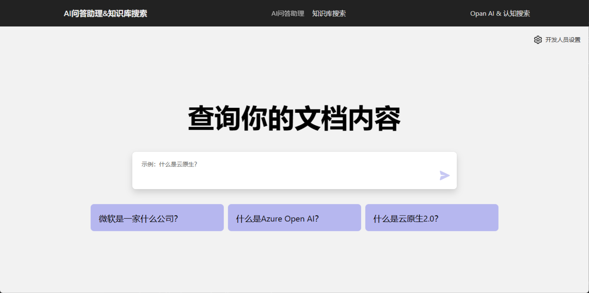
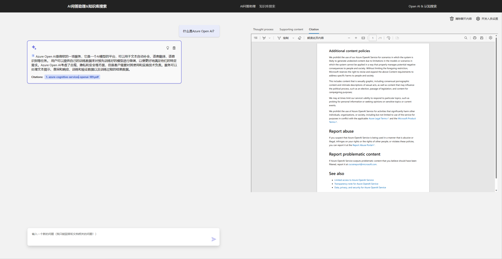
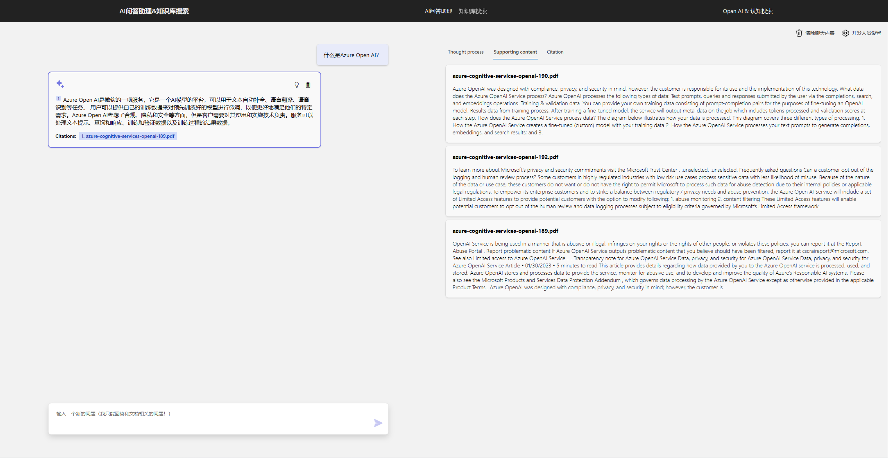
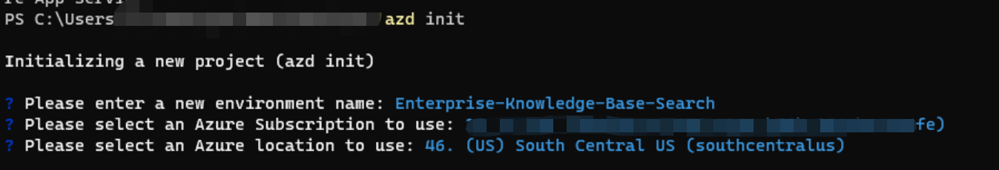

# ChatGPT + 企业数据与 Azure OpenAI 和认知搜索

此示例演示了使用检索增强生成模式对自己的数据创建类似 ChatGPT 的体验的几种方法。它使用 Azure OpenAI Service 访问 ChatGPT 模型 （gpt-35-turbo），并使用 Azure 认知搜索进行数据索引和检索。

存储库包含示例数据，因此可以进行端到端尝试。在此示例应用程序中，我们使用名为 Contoso Electronics 的虚构公司，该体验允许其员工询问有关福利、内部策略以及职位描述和角色的问题。

## 效果

* 聊天和问答界面
* 探索各种选项，以帮助用户通过引用、跟踪源内容等来评估响应的可信度。
* 显示模型 （ChatGPT） 和检索器（认知搜索）之间的数据准备、提示构造和交互编排的可能方法
* 直接在 UX 中进行设置，以调整行为并尝试选项

* 查询页面显示效果

* 源文档页面显示效果

* 摘取段落面显示效果

## 开始

> **重要:** 若要部署和运行此示例，需要一个为 >  **Azure OpenAI 服务启用访问权限的 Azure 订阅。** 您可以在此处请求访问权限。还可以访问此处获取一些免费的 Azure 额度，以帮助你入门。

### 先决条件

#### 在本地运行
- [Azure Developer CLI](https://aka.ms/azure-dev/install)
- [Python 3+](https://www.python.org/downloads/)
    - **重要提示：**: Python 和 pip 包管理器必须位于 Windows 中的路径中，安装程序脚本才能正常工作。
    - **重要提示：**: 确保您可以从控制台运行。在 Ubuntu 上，您可能需要运行才能链接到  `sudo apt install python-is-python3` to link `python` to `python3`.    
- [Node.js](https://nodejs.org/en/download/)
- [Git](https://git-scm.com/downloads)
- [Powershell 7+ (pwsh)](https://github.com/powershell/powershell) - 仅适用于 Windows 用户。
   - **重要提示**: 确保可以从 PowerShell 命令运行。 `pwsh.exe` 如果此操作失败，则可能需要升级 PowerShell。

>注意：:你必须有Azure的账户权限 `Microsoft.Authorization/roleAssignments/write` 许可, 例如 [管理员](https://learn.microsoft.com/azure/role-based-access-control/built-in-roles#user-access-administrator) 或者 [所有者](https://learn.microsoft.com/azure/role-based-access-control/built-in-roles#owner).  

#### 在 GitHub 代码空间或 VS 代码远程容器中运行

在 GitHub 代码空间或 VS 代码远程容器中运行

### 安装

#### 项目初始化

1. 下载代码库并在终端中打开到它
2. 运行 `azd login`
3. 运行 `azd init`
4. 输入 Please enter a new environment name: `Enterprise-Knowledge-Base-Search`
5. 选择订阅号：`Please select an Azure Subscription to use: {Name of existing resource group that OpenAI service is provisioned to}`
6. 选择部署区域：`Please select an Azure location to use:{Name of existing resource group that OpenAI service is provisioned to}`
它将如下所示：

    * 对于目标位置，当前支持此示例中使用的模型的区域为 **“美国东部”** 或 **“美国中南部”** 。有关地区和型号的最新列表，请查看此处[here](https://learn.microsoft.com/en-us/azure/cognitive-services/openai/concepts/models)

#### 从零开始：

如果没有任何预先存在的 Azure 服务，并且想要从全新部署开始，请执行以下命令。 
1. - 运行 `azd up`  - 这将预配 Azure 资源并将此示例部署到这些资源，包括基于文件夹中找到的文件生成搜索索引。`./data` folder.
2. 成功部署应用程序后，您将看到打印到控制台的 URL。单击该 URL 以在浏览器中与应用程序进行交互。 

它将如下所示：

    
>注意：完全部署应用程序可能需要一分钟时间。如果您看到“Python 开发人员”欢迎屏幕，请等待一分钟并刷新页面。

#### 使用现有资源：

1. 运行 `azd env set AZURE_OPENAI_SERVICE {Name of existing OpenAI service}`
2. 运行 `azd env set AZURE_OPENAI_RESOURCE_GROUP {Name of existing resource group that OpenAI service is provisioned to}`
3. 运行 `azd env set AZURE_OPENAI_CHATGPT_DEPLOYMENT {Name of existing ChatGPT deployment}`. 仅当您的 ChatGPT 部署不是默认的“Chat”时才需要。
4. 运行 `azd env set AZURE_OPENAI_GPT_DEPLOYMENT {Name of existing GPT deployment}`. 仅当您的 ChatGPT 部署不是默认的“davinci”时才需要。
5. 运行 `azd up`

> 仅当您的 ChatGPT 部署不是默认的“davinci”时才需要。 `./infra/main.parameters.json` -- `azd env set` 

#### 部署或重新部署存储库的本地克隆：
* 只需运行 `azd up`

#### 本地运行：
1. 运行 `azd login`
2. 本地运行： `app`
3. 运行 `./start.ps1` or `./start.sh` 或/或运行“VS Code 任务：启动应用”以在本地启动项目。

#### 共享环境

如果要向其他人授予对完全部署和现有环境的访问权限，请运行以下命令。

1. 安装  [Azure CLI](https://learn.microsoft.com/cli/azure/install-azure-cli)
2. 运行 `azd init -t azure-search-openai-demo`
3. 运行 `azd env refresh -e {environment name}` --请注意，他们需要azd环境名称、订阅Id和位置才能运行此命令-您可以在您的目录中找到这些值 `./azure/{env name}/.env`   这将填充他们的azd环境的.env文件，其中包含本地运行应用程序所需的所有设置。
.4 运行 `pwsh ./scripts/roles.ps1` -这将为用户分配所有必要的角色，以便他们可以在本地运行应用程序。如果他们没有在订阅中创建角色的必要权限，那么您可能需要为他们运行此脚本。只要确保将azd .env文件或活动shell中的' AZURE_PRINCIPAL_ID '环境变量设置为他们的Azure Id即可 `az account show`.

### 快速入门

* 在 Azure 中：导航到 azd 部署的 Azure WebApp。azd 完成后将打印出 URL（作为“终结点”），也可以在 Azure 门户中找到它。
* 本地运行：导航到 127.0.0.1：5000

进入网络应用后：
* 在聊天或问答上下文中尝试不同的主题。对于聊天，请尝试跟进问题，澄清，要求简化或详细说明答案等。
* 探索引文和来源
* 单击“设置”以尝试不同的选项，调整提示等。

## 资源

* [使用 ChatGPT 彻底改变您的企业数据：采用 Azure OpenAI 和认知搜索的下一代应用程序](https://aka.ms/entgptsearchblog)
* [Azure 认知搜索](https://learn.microsoft.com/azure/search/search-what-is-azure-search)
* [Azure OpenAI Service](https://learn.microsoft.com/azure/cognitive-services/openai/overview)

### Azure OpenAI Service
>注意：本演示中使用的 PDF 文档包含使用语言模型（Azure OpenAI 服务）生成的信息。这些文档中包含的信息仅用于演示目的，并不反映 Microsoft 的意见或信念。Microsoft 对本文档所含信息的完整性、准确性、可靠性、适用性或可用性不作任何明示或暗示的陈述或保证。微软保留所有权利。

### 常见问题

***Question***: 当 Azure 认知搜索支持搜索大型文档时，为什么我们需要将 PDF 分解为块？

***Answer***: 由于令牌限制，分块允许我们限制我们发送到 OpenAI 的信息量。通过分解内容，它使我们能够轻松找到可以注入 OpenAI 的潜在文本块。我们使用的分块方法利用文本的滑动窗口，以便以一个块结尾的句子将开始下一个块。这使我们能够减少丢失文本上下文的机会。

### 故障 排除

如果在运行 ：  `azd deploy`: `read /tmp/azd1992237260/backend_env/lib64: is a directory`,时看到此错误，请删除 并重新运行该命令。`./app/backend/backend_env folder` and re-run the `azd deploy` 。此处正在跟踪此问题：https://github.com/Azure/azure-dev/issues/1237

### Louis Yan
#### power by https://github.com/Azure-Samples/azure-search-openai-demo